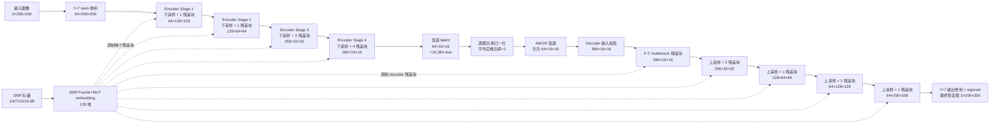

# 当前方法说明：从零重新理解 S33 主线

更新时间：2026-07-22
适用状态：截至 S33；SwinJSCC 对比尚未启动，strong-matched diffusion 尚未重训。

## 先说结论：现在真正的方法是什么

截至 S33，项目真正活着、准备写进当前 backbone 论文的方法是：

> **一个固定码率、逐图感知信道 SNR 的四级残差 JSCC 编码器—解码器。它把一张 `256×256` RGB 图原生压成恰好 `16,384` 个实信道符号，经 AWGN 后直接恢复成 `256×256` 图像。**

这里的“逐图感知 SNR”是指：发送端 encoder 和接收端 decoder 都知道当前图像对应的 SNR，并用同一个 SNR embedding 调整内部残差块。这里的“固定码率”是指：无论 SNR 是 1、4、7、13 还是 19 dB，始终发送相同的 `16,384 real`，不会因信道变好或变差改变符号数量。

**当前最终输出就是 strong decoder 的输出。** 推理链路中没有 diffusion，没有 B1 后处理，没有 M2，也没有 envelope。分类器、LPIPS、MS-SSIM 等只在实验结束后评估输出，不参与 encoder、信道或 decoder 的推理决策。

代码入口是 `src/cadsd_jscc/strong_jscc.py`；当前论文主 checkpoint 是 S33 的 `64×16×16` 版本。S31 是同一方法家族的 `77×16×16=19,712 real` 较宽码率版本；S33 才是与 author-JSCC 严格对齐的主版本。

## 一张图怎样走完整个系统

下面只画当前 S33 真正执行的前向链路。图中的维度省略 batch 维；处理单张图时 batch 维为 1。



换成大白话，这条链路做了三件事：

1. **Encoder 把图片变成适合无线传输的连续数值。** 四次下采样把空间尺寸从 `256×256` 降到 `16×16`，同时把通道数逐步加宽，让网络在更小的空间网格中表达整张图的内容。
2. **信道把这些数值加噪。** Encoder 输出先逐图归一化到单位平均功率，再按当前 SNR 加 AWGN。低 SNR 加的噪声大，高 SNR 加的噪声小。
3. **Decoder 从带噪 latent 直接恢复图片。** 它把 `16×16` 逐级放大回 `256×256`。SNR embedding 同时告诉 encoder 和 decoder：“这张图当前信道有多差”，使同一个模型能在五档 SNR 下使用不同的内部特征处理方式。

## 每个模块到底在做什么

### 1. SNR embedding：把一个数字变成网络能使用的条件

输入是每张图的一个 SNR 标量。代码先把它缩放，再生成多频率的正弦/余弦 Fourier 特征，最后经过两层 MLP，得到 `128` 维 condition vector。

这个 condition vector 送到 encoder 和 decoder 的所有条件残差块。每个残差块根据它生成一组 scale 和 shift，对内部 feature 做仿射调制。直观理解是：

- 信道差时，网络可以采用更抗噪、更保守的表示和恢复方式；
- 信道好时，网络可以更多保留精细内容；
- 变化发生在同一个模型内部，不需要为每个 SNR 保存一套网络。

虽然 embedding 在代码上可以接收任意数值，但当前成功模型只在 `[1,4,7,13,19] dB` 五个离散档位上逐图均匀训练。论文不能把它写成已经使用连续 `Uniform[1,19]` 训练，也不能在没有实验时声称任意 SNR 连续泛化已经得到验证。

### 2. 条件残差块：当前 backbone 的基本单元

每个块大致做：归一化、卷积、SNR 条件调制、再卷积，最后与块输入相加。第二个卷积和 condition 末层都做零初始化，因此初始化时残差支路输出为零、整个块从恒等映射开始学习，不会一上来就大幅破坏特征。

它与普通固定卷积 JSCC 的主要结构区别是：**SNR 不只是传给信道层，也真正进入 encoder 和 decoder 的内部特征变换。**

### 3. Encoder：原生生成固定长度的信道表示

当前 encoder 有四个 stride-2 下采样 stage：

| 位置 | 输出维度 | 作用 |
|---|---:|---|
| 输入 | `3×256×256` | RGB 图像，取值 `[0,1]` |
| stem | `64×256×256` | 把 RGB 映射到基础 feature |
| stage 1 | `64×128×128` | 第一次压缩空间尺寸 |
| stage 2 | `128×64×64` | 提高通道容量、继续下采样 |
| stage 3 | `256×32×32` | 学习更大范围的图像结构 |
| stage 4 | `384×16×16` | 得到紧凑的高层表示 |
| channel head | `64×16×16` | 直接产生 `16,384` 个待发送实数 |

这里没有“先生成一个更长向量，再挑一部分发送”。`64×16×16` 本身就是网络训练和输出的完整 channel tensor。

### 4. 功率归一化与 AWGN：把神经网络 latent 变成物理信道输入

对每张图单独计算 `16,384` 个实坐标的平均平方值，然后整体缩放，使平均实维功率精确接近 1。这样不同图片不会因为 encoder 输出幅度不同而偷偷获得不同的发送功率。

项目把相邻两个实坐标按 I/Q 两部分计作一次复信道使用，因此：

```text
16,384 real symbols = 8,192 complex channel uses
```

若线性 SNR 为 `gamma=10^(SNR_dB/10)`，单位归一化功率下，每个实坐标所加高斯噪声的方差为：

```text
sigma_real^2 = 1 / (2*gamma)
```

这就是项目一直使用的 paired-real half-variance AWGN 口径。信道输出维度不变，仍是 `64×16×16`。

### 5. Decoder：使用同一 SNR 条件直接重建最终图

Decoder 先把 64 个 latent channel 投影到 384 个 feature channel，在 `16×16` bottleneck 做 4 个条件残差块，然后四次双线性上采样并卷积，逐级恢复到 `256×256`。最后经过输出卷积和 sigmoid，得到 `[0,1]` 范围的 `3×256×256` RGB 图。

**这张图就是当前系统的最终输出。** 当前 S33 后面没有“再交给 diffusion 修一下”的步骤，也没有依据分类器结果在多个输出之间选择。

## 为什么这个方法逻辑上是合理的

它不是单纯把网络做大，而是把三个约束同时放进一个端到端模型：

1. **信道条件进入表示学习。** Encoder 知道信道质量，可以改变“什么信息更值得保护”；decoder 也知道信道质量，可以改变“收到同样幅度的扰动时该多相信 latent”。
2. **码率从结构上固定。** Bottleneck 形状就是物理预算，不靠推理阶段裁剪、mask 或补零，因此所有发送坐标都在训练时共同学到用途。
3. **端到端直接优化保真恢复。** 当前模型用 MSE 训练，并以验证集五档平均 PSNR 为主选择 checkpoint；目标明确是先建立一个强而稳定的 JSCC 保真端点。LPIPS 和语义 failure 用来检查它是否存在感知或语义代价，不参与 checkpoint 回选；MS-SSIM 只在 PSNR 相同的极少数情况下作 tie-break。

所以当前论文主线不是“JSCC 后面加了一个新模块”，而是：**重新设计了整个固定码率 JSCC 表示通路，使信道条件从 encoder 到 decoder 全程生效，同时保持严格、可审计的原生符号预算。**

## B0、B1、M2、D、envelope 和 strong backbone 到底是什么关系

这些名字来自项目不同阶段，最容易混淆。先给结论表：

| 名词 | 它本质上是什么 | 是否等于当前 S33 方法 | 截至 S33 的状态 |
|---|---|---|---|
| **B0** | “不使用额外恢复/生成模块的纯 JSCC 输出”这一角色名，不一定指某一个固定网络 | **可以。** 当前 S33 strong decoder 输出就是新的 strong-B0 | 角色仍活着；旧弱 B0 checkpoint 已被 strong 替换 |
| **B1** | 接在旧弱 B0 后面的确定性 residual CNN 恢复器；看 B0、SNR、Sobel 和 Laplacian，不使用 diffusion | 不是 | 旧实例退出主线；若未来需要，必须针对 strong-B0 分布重新训练 new-B1 |
| **M2** | 方法分组名：SNR-aware diffusion/refinement 分支或其系统输出 | 不是 | 旧实例暂挂，当前 S33 推理不执行 M2 |
| **D / diffusion** | diffusion 分支产生的候选图像；旧版本从带噪 codeword 的 SNR-matched diffusion state 做短链去噪 | 不是 | 研究方向未永久删除，但旧 D 与 strong 分布不匹配，不能接入当前论文主链 |
| **envelope** | 控制 diffusion correction 强度的 SNR 规则；本质上是“低 SNR 开多少、高 SNR 是否严格归零” | 不是 | 旧规则随旧 diffusion 暂挂；当前 strong-only 链路没有 envelope |
| **strong backbone** | 当前四级、全程 SNR-conditioned、原生 exact-rate 的 encoder/channel/decoder | **是** | 当前唯一活着的论文主方法；S33 是严格 `16,384 real` 主版本 |

### B0 不是一个永远不变的 checkpoint

“B0”最好理解为系统中的角色：**纯 JSCC，不加后处理**。过去这个角色由一个较弱、非原生 exact-rate 的 DeepJSCC 承担；现在这个角色由 S33 strong backbone 承担。

为避免论文读者误会，当前 backbone 论文建议直接写 `StrongJSCC` 或 `Ours-backbone`，只在设计后续 diffusion 对照时把它叫作 `strong B0`。

### B1 和 M2 不是同一个东西

不是，而且两者的思路不同：

- **B1 是确定性恢复器。** 它把旧 B0 图像作为主要输入，再利用 SNR 和由 B0 自己计算的边缘特征预测一个小的图像修正。它不采样、不做 diffusion，也不使用生成先验。
- **M2 是 SNR-aware diffusion 方法组。** 它强调根据信道状态决定 diffusion 的起始状态或修正强度。旧实验中的 `D` 通常就是这个分支产出的候选图。

可以把它们想成：B1 是保守的去噪修图器，M2/D 是带生成先验的候选恢复器。过去曾研究如何把两者融合，但这套旧融合没有进入当前 S33 主链。

### strong backbone 到底替换了谁

它直接替换的是旧的弱 JSCC encoder/channel/decoder，也就是旧 B0 的来源。它并不是把 B1 的某一层换掉，而是让整个发送端和接收端基础表示重新训练。

由于 B1、旧 diffusion 和旧 envelope 都是围绕旧 B0 的图像或 latent 分布训练的，换成 strong backbone 后，它们不能原样复用。直接串接会遇到分布不匹配。因此截至 S33：

- 当前主论文只使用 strong backbone；
- 旧 B1/M2/D/envelope 只作为历史证据，不是当前方法组件；
- diffusion 仍可成为第二方向，但必须冻结 strong-B0 后，从 strong 的新重建/latent 分布重新训练 new-B1、new-D 和相应 control；通过预注册 gate 后才能重新写进方法。

## exact-rate 是怎样实现的

### S33：当前主版本的 `16,384 real`

四次 2 倍下采样把 `256×256` 变成 `16×16`。最后 channel head 固定输出 64 个通道：

```text
64 channels × 16 × 16 = 16,384 real symbols
16,384 / 2 = 8,192 complex channel uses
```

原图有：

```text
3 × 256 × 256 = 196,608 source real dimensions
```

按项目用复信道次数定义 CBR：

```text
CBR = 8,192 / 196,608 = 1/24
```

注意，如果拿 real-symbol 数直接除原图维度，会得到 `1/12`；项目报告 `1/24` 是因为两个实坐标组成一次复信道使用。这两个数字不能混写。

### S31：同一方法家族的 `19,712 real`

S31 只把最终 latent channel 数改为 77：

```text
77 × 16 × 16 = 19,712 real symbols
19,712 / 2 = 9,856 complex channel uses
CBR = 9,856 / 196,608 ≈ 0.0501302
```

S31 和 S33 都是从网络结构中原生得到精确符号数。S33 不是从 S31 的 77 个通道里截取前 64 个，也不是在发送时才把 19,712 截成 16,384；它是 `latent_channels=64` 的独立从零训练模型。

### 当前 strong backbone 还用不用 mask 或 prefix

**不用。**

- 没有 fixed mask；
- 没有 active/inactive coordinates；
- 没有从更长 latent 截 prefix；
- 没有 padding 或补零占位；
- 没有文本、边缘图或其他 side information；
- 每个 SNR 都发送同样的全部 `16,384 real`。

旧弱系统曾先生成 `6×64×64=24,576 real`，再用固定选择规则只激活其中 `19,712` 个；某些版本还把其中 80 个留给语义载荷。那是被 strong backbone 替换掉的旧码率实现，不能拿来描述 S31/S33。

外部评估里提到的 canonical-noise “prefix”只是为了让不同方法使用同一串随机噪声：先生成统一的长噪声向量，再给 S33 取对应的前 `16,384` 个噪声坐标。**它裁的是评测噪声，不是模型 latent，也不改变发送码率。**

## 当前训练与推理边界

当前 S33 的训练合同是：

- COCO2017、`256×256`；
- 随机初始化；
- FP32 共 12 epochs（4 epoch 主阶段 + 8 epoch model-only continuation）；
- 每张图从 `[1,4,7,13,19] dB` 离散均匀采样 SNR；
- AdamW；
- 只用 MSE 训练；
- 用 COCO 固定 val512 的五档平均 PSNR 选择 checkpoint，MS-SSIM 仅作 tie-break；
- 不用 LPIPS、分类器、外部 baseline 排名或 official validation 选择 checkpoint。

当前推理所需的外部输入只有：

1. 一张 RGB 图；
2. 当前 SNR；
3. 信道噪声本身由 AWGN 产生。

系统不需要人工 prompt、发送文本、发送边缘图、重复传图或重传。论文中的 semantic failure 是评估维度，不是当前 inference-time gate。

## 当前论文应该怎样表述，不能怎样表述

可以写：

- 我们提出/实现一个原生 exact-rate 的四级 channel-adaptive residual JSCC backbone；
- SNR condition 深入 encoder 和 decoder 的残差特征变换；
- 单模型覆盖五档离散 SNR，符号数、功率和 side information 均可严格审计；
- S33 是 `16,384 real` 的严格等码率版本，S31 是 `19,712 real` 的较宽工作点；
- 同时报告 PSNR、MS-SSIM、LPIPS 和 semantic failure，避免只看失真均值。

现在不能写：

- 当前方法包含 diffusion；
- B1/M2 已经迁移到 strong backbone；
- envelope 是 S33 的一部分；
- 当前方法使用连续随机 SNR 训练；
- `16,384 real` 是通过裁剪 S31 latent 获得；
- 已经超过 SwinJSCC——SwinJSCC 同合同重训还未执行；
- 方法在所有 SNR 和所有指标上全面支配外部方法。

## 最后三句话

**(a) 当前方法一句话：** 当前方法是一个原生发送 `16,384 real`、让同一 SNR embedding 调制四级残差 encoder 和 decoder、并直接输出恢复图的固定码率 channel-adaptive JSCC backbone。

**(b) 相比 author-JSCC / SwinJSCC 的核心不同：** author-JSCC 使用 DiffJSCC 配套的残差前端，SwinJSCC 使用 shifted-window Transformer 加 Channel ModNet，而我们使用从零实现的卷积条件残差主干，把逐图 SNR 调制深入编码与解码各级，并用 bottleneck 形状直接锁死码率、不依赖 rate mask 或 side information；其中对 SwinJSCC 的性能胜负仍待同合同重训。
**(c) 最想让审稿人记住的创新点：** 在严格固定的 `16,384-real` 预算内，不靠裁剪、mask 或生成式后处理，而是让信道状态从发送端到接收端全程参与原生表示学习，形成一个在低中 SNR 有竞争力且码率、功率和语义风险都可审计的强 JSCC 保真基座。
