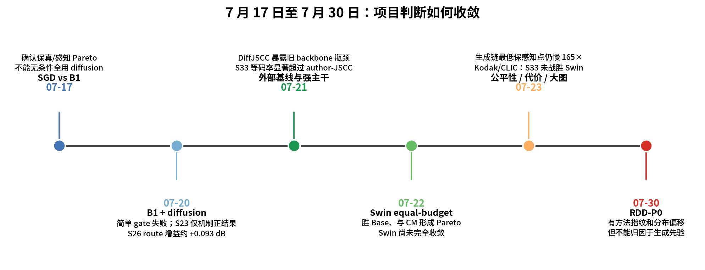
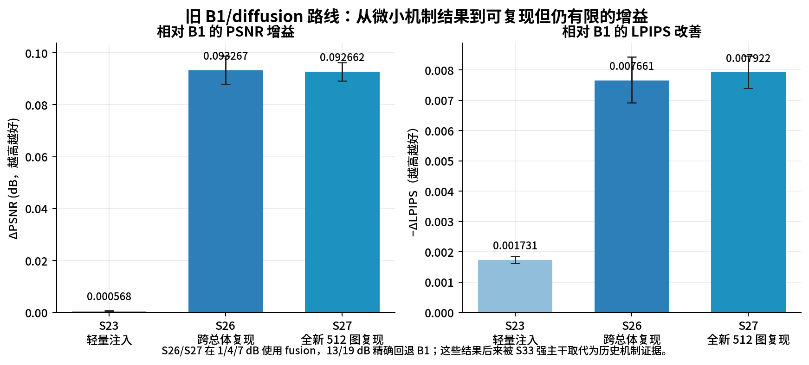
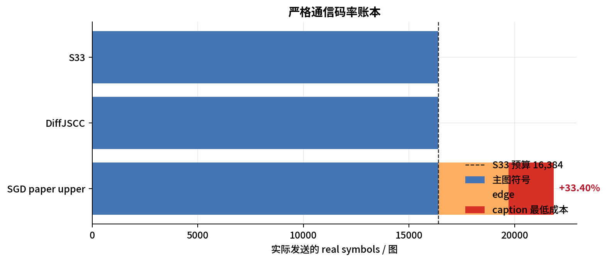
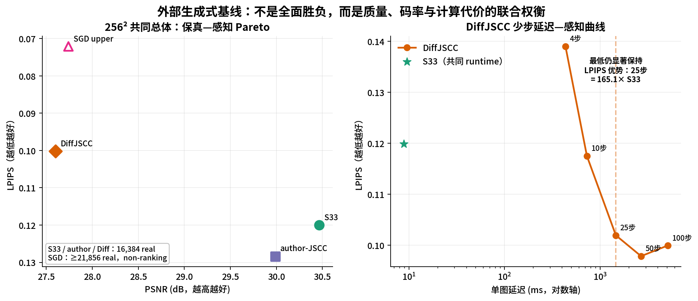
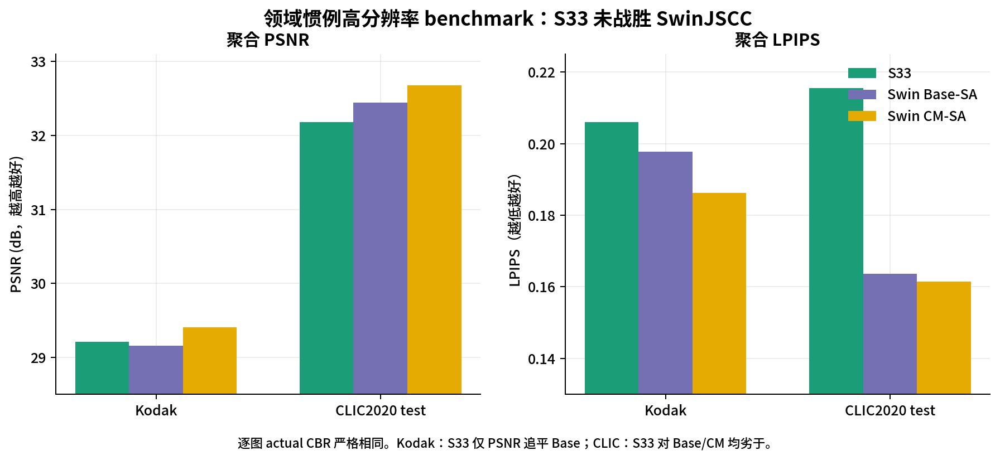
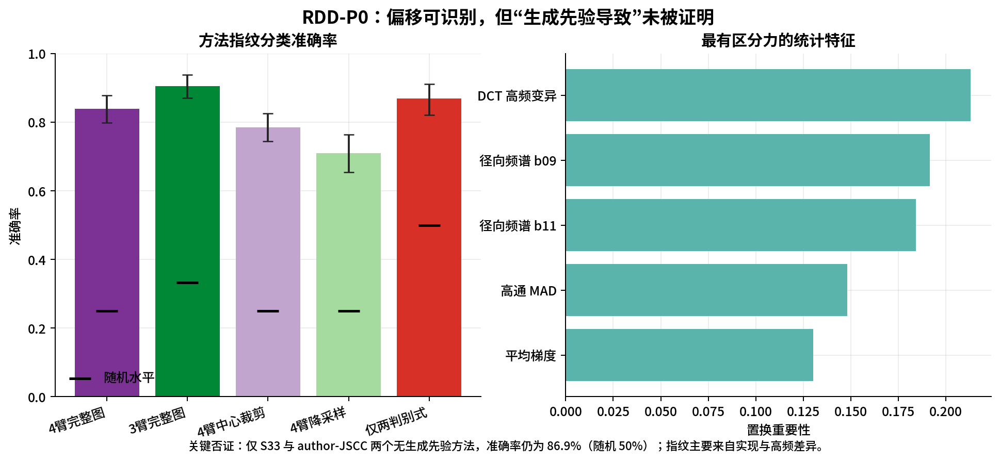

# 组会汇报：7 月 17 日至 7 月 31 日项目进展

> 项目：Channel-Adaptive Semantic-Drift-Controlled Diffusion-JSCC
> 汇报日期：2026-07-31
> 覆盖范围：2026-07-17 至仓库最新记录（2026-07-30）
> 说明：本文只整理已经落盘的冻结结果，不重跑实验，不把计划写成完成；失败和结论收缩均保留。

## 1. 一页结论

这两周不是沿着一条方法不断加模块，而是完成了三次关键判断转向：

1. **7 月 17–20 日：确认 diffusion 有互补信息，但在旧弱 backbone 上能安全兑现的增益有限。** 最稳的旧路线 S27 在全新 512 图总体上相对 B1 得到 `+0.0927 dB PSNR / −0.00792 LPIPS`，且低 SNR 使用 diffusion、高 SNR 精确回退 B1；这是可复现的机制证据，但不足以构成强外部竞争力。
2. **7 月 21–23 日：发现真正瓶颈是 JSCC backbone，并训练出 S33。** S33 在严格 `16,384 real` 等码率的 256×256 开发总体上相对 author-JSCC 聚合显著领先 `+0.4799 dB`，但在领域惯例 Kodak/CLIC 高分辨率 benchmark 上没有战胜 SwinJSCC。因此 S33 不能再称为最强 backbone，只能定位成**质量尚有差距、但推理便宜的判别式端点**。
3. **7 月 23–30 日：把研究问题收敛到“代价—质量—可靠性”。** DiffJSCC 即便从 100 步压到仍显著保持 LPIPS 优势的 25 步，也要 `1.458 s/图`，是同 runtime S33 的 `165.1×`，FLOPs 下界约 `472×`；但 RDD-P0 只证明了“方法指纹和分布偏移可识别”，没有证明“生成先验定向导致 deception”。

截至现在，最准确的项目判断是：

> **我们尚未战胜所有论文方法。我们已经得到一个低代价、严格等码率、低 SNR 较强的 S33 基座，并用公平测量证明现有生成式 JSCC 的感知收益伴随百倍级计算代价；下一步真正值得验证的是，轻量接收端 refiner 能否用很小代价缩小 S33 与 Swin/生成式方法的质量差距，同时不增加语义失败。**

| 问题 | 当前答案 | 证据级别 |
|---|---|---|
| diffusion 是否含有普通 CNN 不可完全替代的信息？ | **有**；S27 相对同容量 control 仍有显著增益 | 已在全新 512 图总体复现，但属于旧弱 backbone 历史证据 |
| S33 是否强于 author-JSCC？ | 在 256²、严格等码率开发总体上，**聚合显著强于** | 64 图×3 seed×5 SNR；不是最终独立测试 |
| S33 是否强于 SwinJSCC？ | **否**；Kodak 只追平 Base 的 PSNR，CLIC 对 Base/CM 均劣于 | 领域 benchmark，结论可信；CLIC 只有 1 个 channel seed |
| DiffJSCC 是否在同码率下全面优于 S33？ | **否**；S33 保真更高，DiffJSCC LPIPS 更好，构成 Pareto | 共同 960 键；DiffJSCC 与 S33 都为 16,384 real |
| 生成式 JSCC 优化后是否仍很慢？ | **是**；最低保 LPIPS 点仍慢 165.1× | 同卡、batch=1、同 runtime、完整组件计时 |
| 低 SNR 是否观察到“清晰但语义错”的 hallucination？ | 本轮 SGD upper 审计中**没有观察到**；S33 主要是模糊/噪声崩坏 | 定向人工审计，不等于证明 hallucination 不存在 |
| RDD deception 是否已有坚实立论？ | **没有**；只得到可识别偏移，无法归因到生成先验 | 最新 P0 为结论有限/偏负结果 |



## 2. 当前到底在做什么

### 2.1 当前已经存在、可运行的主方法：S33

S33 是一个约 `31.03M` 参数的四级 channel-adaptive JSCC：

```text
256×256 RGB
    ↓
四级卷积编码器（每级接收 SNR conditioning）
    ↓
原生输出恰好 16,384 个 real channel symbols
    ↓
功率归一化 + canonical paired-real AWGN
    ↓
四级卷积解码器（每级接收 SNR conditioning）
    ↓
256×256 RGB reconstruction
```

它不使用 mask/prefix、补零、重复发送、edge/caption side information，也不含 diffusion。`16,384 real / (3×256×256) = 1/12` real-per-source-scalar；按项目 complex-use 口径为 `CBR=1/24`。

### 2.2 当前获批但尚未执行的增量：P1 轻量接收端 refiner

计划冻结 S33 encoder/decoder，只在接收端增加目标 `2M–6M` 参数的 SNR-conditioned residual U-Net：

```text
S33 RGB reconstruction + normalized SNR
    ↓
轻量 receiver-side refiner
    ↓
refined RGB
```

通信符号仍为 `16,384 real`，新增 side information 为 0。训练目标预注册为 LPIPS + 轻 MSE + PatchGAN + anchor consistency；必须同时通过：LPIPS 显著改善、PSNR 不劣于 `−0.10 dB` margin、语义失败不显著上升。**截至本报告，P1 只有预注册，没有 smoke、训练或结果。**

### 2.3 哪些已经退出当前主线

- B1、matched diffusion、S19/S23/S26/S27 route：保留为“diffusion 确有互补信息”的历史机制证据，不再是当前最终 backbone。
- 旧 B0/B1 上的 M2/envelope：旧分布训练的权重不得直接接到 S33 上冒充新方法。
- 14–29 天的 S34C 公平生成式重训：用户已在执行前暂停；没有训练结果。
- RDD deception：只做完 P0 前置验证，证据不足，未升级为实现主线。

### 2.4 `S` 编号到底表示什么

`S` 是 **Stage（研究阶段）**，不是网络名称，也不是“第 S 个模型”。一个 S 可以是训练、评估、数据准备、消融或纯分析；所以不能把 `S27→S28→S29` 理解成模型连续升级。

文件名前缀进一步说明该阶段做了什么：

| 前缀 | 含义 | 是否一定产生新模型 |
|---|---|---|
| `EXP-Sxx` | 训练或正式实验 | 不一定，但通常会运行模型 |
| `ANALYSIS-Sxx` | 评估、统计、复现或诊断 | 否 |
| `EXPORT-Sxx` | 冻结数据总体、cache 或 reconstruction | 否 |
| `SMOKE-Sxx` | 单 batch/单图可运行性检查 | 否 |
| `SxxA/B/C/D` | 同一大阶段的不同分支 | 各分支独立判断 |
| `SxxB` continuation | 同一方法的修复或续训版本 | 可能 |

早期里程碑与实际阶段号后来发生过一次双编号：例如 `MILESTONES.md` 中的 `S8 / S33` 和 `S9A / S34A`，斜杠前是粗粒度论文里程碑，斜杠后才是实际按时间递增的实验阶段。组会和论文建议只使用后者，即 S33、S34A 等。

#### S1–S19：从基线到 diffusion 互补信息验证

| Stage | 实际含义 | 最终状态 |
|---|---|---|
| S1 | CIFAR-10 DeepJSCC + AWGN sanity baseline | 完成；验证信道、模型与指标链 |
| S2-HR | COCO 256×256 高分辨率 DeepJSCC 基线 | 完成；建立后续自然图实验入口 |
| S2 | Blind diffusion pilot | 完成；视觉可能改善，但漂移/质量不稳定 |
| S3 | CLIP、冻结分类器、caption-CLIP 等语义诊断 | 完成；建立 semantic drift 测量链 |
| S4/S5 | SNR-aware diffusion、VAE 诊断、pixel residual restoration 与 semantic fallback | 多轮正负结果；`EXP-S4-*` 文件在里程碑语义上主要属于 S5 adaptive-control 阶段 |
| S6 | 最小闭环、alpha shrink/predictor、gate 与分类器 ensemble 审计 | 完成；大量 controller 负结果也在此阶段 |
| S7 | 严格等总码率 `c6 main + c2 decoded structure` | 完成；验证结构支路可用 |
| S8 | rate-accounted semantic sketch + Semantic FiLM | 部分正结果；side signal 有用，但样本特异语义 grounding 未成立 |
| S9 | 把 S8 sketch 合回 M3 semantic controller | 完成审计；没有形成最终强方法 |
| S10 | matched-rate 6-step short-chain residual diffusion | 未晋级；LPIPS 微改善但 semantic-risk gate 失败 |
| S11 | 给普通 `c8` 配同容量 refiner 的公平 control | 完成；排除“不公平后端容量”解释 |
| S12 | B1-anchored semantic-preserving short-chain diffusion | 未晋级；感知改善但 semantic-risk gate 失败 |
| S13 | COCO 10k/1k 扩容与强 B1 anchor | 完成；B1 获得大幅、稳定质量提升 |
| S14 | 扩容后的 B1-anchored diffusion | NEGATIVE；语义净风险改善，但质量/感知 gate 失败 |
| S15 | UInt2 reservation-aware B1 历史标签 | 完成；注意文档明确说明它实际仍属 S5 validation，不是独立主线 |
| S16 | 精确 `19,712 real` 低码率 B1 + diffusion 闭环 | 完成；形成后来使用的 B1 定义 |
| S17 | exact-rate channel-state-matched latent diffusion 与 decoder-aware 对照 | 机制正结果；首个 AMP run 失败，FP32/对照完成 |
| S18 | 在新 512 图总体上冻结 SNR identity/envelope policy | 完成；使高 SNR 能安全回退 |
| S19 | B0-only control vs diffusion-fusion 等容量因果消融 | 完成；证明 diffusion observation 有不可完全替代的互补信息，但高 SNR 有负迁移 |

#### S20–S36：外部基线、强 backbone 与当前方向

| Stage | 实际含义 | 是否产生新方法/当前状态 |
|---|---|---|
| S20 | 判断 SGD-JSCC 是否应全程替代 B1 | 纯对比分析；结论为保真—感知 Pareto，不能全用 SGD |
| S21 | 尝试 output-level gate、bounded residual、convex mixing 合并 B1 与 diffusion | 实验失败；gate 塌零或 PSNR 崩坏 |
| S22 | 把 `D−B0` 注入 B1 feature 的 1,728 参数 adapter | 有非零方向，但所有 checkpoint 都以 PSNR 换 LPIPS，按 gate 选回 epoch 0 |
| S23 | 对 S22 方向做固定 `alpha=0.15` shrink，并在高 SNR exact-B1 fallback | 首个安全非零机制闭环；增益只有 `+0.00057 dB` |
| S24 | 统一复核 S17–S23 的指标、CI、语义失败和数据流 | 纯汇总分析；没有新模型 |
| S25 | 用 oracle 测 S23 的逐图 amplitude/controller 理论上限 | 纯诊断；headroom 太小，关闭该 controller 路线 |
| S26 | 将更强 S19 fusion 用在 1/4/7 dB，13/19 dB exact B1，在另一总体复现 | 得到约 `+0.0933 dB`；当时更新为最好旧方法 |
| S27 | 把 S26 同一路由放到完全新、无重叠的 512 图总体 | 正式复现；约 `+0.0927 dB`，确认 S26 稳定 |
| S28 | 在 S20 同一 960 键上比较当时 current 与 SGD | 纯外部定位；形成 fidelity/perception Pareto；原 exact-batch gate 因浮点差记 NEGATIVE |
| S29 | 按原 batch=64 重放 S28 的 B1，诊断浮点差 | 纯复现审计；6/6 零误差，确认合同无误 |
| S30 | 官方 DiffJSCC checkpoint/full-chain 复现，并比较 author-JSCC | 纯外部复现；发现旧项目最大问题是弱 backbone |
| S31 | 训练 `19,712-real`、31M、四级、双侧 SNR-conditioned strong backbone | 产生新 backbone；首个 AMP run 失败后转 FP32 |
| S31B | S31 的 FP32 修复/续训 | 产生冻结的 19,712-real strong checkpoint |
| S32 | 把冻结 S31B 放到 S30 同 960 键上比较 author-JSCC | 纯外部评估；聚合超过 author，但码率尚不相等 |
| S33 | 从零训练原生 `16,384-real` strong backbone，并做严格等码率 gate | **当前冻结基座**；开发总体显著超过 author-JSCC |
| S34A | 官方 SwinJSCC Base-SA + 参数匹配 CM-SA 的 equal-budget 对比 | 已完成；对 Base 有利、对 CM 为 Pareto；Kodak/CLIC 后确认 S33 未战胜 Swin |
| S34B | strong backbone 增益来源消融：SNR conditioning、四级结构、训练合同 | **计划，未执行** |
| S34C | 严格总码率公平重训 DiffJSCC/SGD-like | 长版**执行前暂停**；只完成 C-Lite 码率透明度分析 |
| S34D | 同卡公平测量生成式 JSCC 延迟、参数、FLOPs与少步质量曲线 | 纯测量；25-step DiffJSCC 最低保 LPIPS 点仍慢 165.1× |
| S35 | 原计划：在 S33 新分布上重训 matched B1/M2/diffusion/envelope | 被新方向取代，未执行 |
| S35R-P0 | 新 refiner 路线的前置测量：SGD 是否随 SNR 减少计算步数 | 已完成；五档都固定 50 次 denoiser |
| S35R-P1 | 冻结 S33 后增加 2M–6M receiver-only refiner | **只预注册，未 smoke、未训练** |
| S36 | official Imagenette validation 一次性解封 | **未执行，继续封存** |

另外，`A0/A1` 与 `RDD-P0` 不属于 S 序列：A0 是 Kodak/CLIC benchmark 和码率 manifest 搭建；A1 是 S33-vs-Swin 高分辨率判别式主表；RDD-P0 是独立的分布偏移前置分析。

## 3. 按时间展开的实验进展

### 3.1 7 月 17 日：S20 判断“是否应全程使用 SGD-JSCC”

实验使用冻结的 64 张 Imagenette policy-dev clean-correct 图、5 档 SNR、3 个 channel seed，共 960 个严格配对观测/方法。

| 方法 | PSNR ↑ | MS-SSIM ↑ | LPIPS ↓ | 语义失败 ↓ | 延迟 |
|---|---:|---:|---:|---:|---:|
| B0-full | 27.1058 | 0.927514 | 0.255417 | 111/960 | — |
| B1 | **28.1246** | 0.946697 | 0.159398 | 35/960 | 2.642 ms |
| SGD paper upper | 27.7404 | **0.952973** | **0.072101** | **25/960** | 2064.7 ms |

SGD 相对 B1：

- PSNR `−0.3842 dB`，95% CI `[−0.6153,−0.1603]`；
- LPIPS `−0.08730`，显著更好；
- 语义上 `11 new / 21 repair`，失败率差 CI 跨 0；
- main + edge 已用 `19,712 real`，再加 caption 最低为 `≥21,856 real`。

**当时结论：** SGD 是强感知上界，但没有全面支配 B1；不能因为“看起来更真”就无条件替换保真链，更不能忽略它的额外码率与千倍量级延迟。该结果促成“B1 锚点 + 受控 diffusion”的合并路线。

### 3.2 7 月 20–21 日：把 B1 与 diffusion 合并，并查清增益上限

这一阶段做了多条路线，既有失败也有阶段正结果。

#### 简单合并为什么失败

- 带 penalty 的 learned gate 第 1 轮塌到 0；去掉 penalty 后仍塌到 0。
- bounded residual 很快顶到 envelope，上游误差被放大，PSNR 崩到约 `22.73 dB`。
- 120 个无训练凸组合中，只有全零、即原 B1 同时满足约束。
- S22 用 1,728 参数把 `D−B0` 注入 B1 feature；所有非零 epoch 都改善 LPIPS，但都损失 PSNR，预注册选择最终只能回到 epoch 0。

#### S23：第一个安全非零闭环，但效应极小

固定 S22 最早非零方向并用全局 `alpha=0.15` shrink 后，独立 holdout 相对 B1：

- PSNR `+0.000568 dB [0.000378,0.000771]`；
- LPIPS `−0.001731 [−0.001849,−0.001622]`；
- 13/19 dB 像素级精确回退 B1；
- `3 new / 7 repair`，但语义失败差 CI 跨 0。

这是机制突破，不是有论文意义的效应量。S25 进一步用能读取原图和评估器的 oracle 查上限，semantic-safe controller 相对固定 alpha 的 PSNR headroom 也只有 `+0.001365 dB`，低于预注册 `+0.02 dB` 门槛，因此正式关闭这条 controller 细化路线。

#### S26/S27：更强 fusion + exact fallback 得到稳定复现

S26/S27 固定为 1/4/7 dB 使用 S19 fusion，13/19 dB 结构性精确返回 B1。S27 使用与既往总体 path/SHA 完全不重叠的 512 张新 COCO 图：

| S27，512 图×5 SNR | PSNR ↑ | MS-SSIM ↑ | LPIPS ↓ | majority failure ↓ |
|---|---:|---:|---:|---:|
| B1 | 27.32357 | 0.943408 | 0.188371 | 1561/2560 |
| 等容量 routed control | 27.35043 | 0.944204 | 0.183942 | 1537/2560 |
| routed diffusion fusion | **27.41623** | **0.945718** | **0.180449** | **1517/2560** |

fusion 相对 B1 为 `+0.092662 dB [0.089147,0.096313]`、`−0.007922 LPIPS`；相对同容量 control 仍有 `+0.065799 dB`，说明 diffusion observation 的信息不能被等容量 B0-only CNN 完全替代。



**阶段判断：** 旧路线科学上并非无效，但增益只有约 `0.09 dB`，而且依赖低 SNR route；后来 S33 单独替换 backbone 带来的提升远大于它，所以这些结果降为历史机制证据。

### 3.3 7 月 21 日：DiffJSCC 外部复现暴露 backbone 瓶颈

S30 跑通官方 DiffJSCC 全链 960 个观测。关键不是 DiffJSCC 最终输出，而是它自带的 author-JSCC 前端：

| 方法 | real symbols | PSNR ↑ | MS-SSIM ↑ | LPIPS ↓ | failure ↓ |
|---|---:|---:|---:|---:|---:|
| 旧 current route | 19,712 | 28.2237 | 0.949057 | 0.152084 | 29/960 |
| author-JSCC | **16,384** | **29.9861** | **0.963092** | **0.128342** | **22/960** |
| DiffJSCC final | 16,384 | 27.5984 | 0.940799 | **0.100223** | 23/960 |

旧 current 即使多用码率，仍比 author-JSCC 低 `1.7625 dB`。诊断确认旧项目 backbone 只有约 14 万参数、两级下采样、固定 7 dB 训练、无逐层 SNR modulation，而且依赖 mask/prefix；继续堆后处理模块无法补回发送端没有编码的信息。

因此项目优先级第一次真正改变：**先升级 JSCC 基座，再决定 diffusion 是否值得保留。**

### 3.4 7 月 21 日：S31/S33 强 backbone 与严格等码率结果

S31 建立约 31M 参数的四级、encoder/decoder 双侧 SNR-conditioned backbone。19,712-real 版本先在开发总体上超过 author-JSCC，随后 S33 改为原生 `16,384 real`，完全取消 mask/prefix，完成严格等码率 gate。

| 256² 开发总体，64×3×5 | S33 | author-JSCC | S33−author [95% CI] |
|---|---:|---:|---:|
| PSNR ↑ | **30.466064** | 29.986135 | **+0.479929 [0.370006,0.598197]** |
| MS-SSIM ↑ | **0.969708** | 0.963092 | **+0.006616 [0.005856,0.007375]** |
| LPIPS ↓ | **0.119985** | 0.128342 | **−0.008357 [−0.010343,−0.006339]** |
| T_cls failure ↓ | **9/960** | 22/960 | rate difference `−1.354 pp` |

分 SNR 的 PSNR 差为：

- 1 dB：`+0.9663 [0.8814,1.0571]`；
- 4 dB：`+0.7717 [0.6754,0.8688]`；
- 7 dB：`+0.5261 [0.4270,0.6254]`；
- 13 dB：`+0.1312 [0.0044,0.2688]`，但 LPIPS 更差；
- 19 dB：`+0.0043 [−0.1615,0.2027]`，按 `0.10 dB` 非劣规则未通过，且 LPIPS 更差。

**可说：** S33 在这一冻结开发总体上严格等码率聚合显著超过 author-JSCC，优势主要来自低中 SNR。
**不能说：** 每个 SNR、每个指标都全面超过，更不能把 64 张 policy-dev 当最终独立测试。

### 3.5 7 月 22 日：SwinJSCC equal-budget 对比

官方 Base-SA `28.18M` 与参数匹配 CM-SA `31.35M` 都按 S33 的 COCO、16,384 real、离散五档 SNR、FP32 4+8 epochs、equal optimizer-step 合同重训。

| 对手 | S33 / Swin PSNR | ΔPSNR [95% CI] | S33 / Swin LPIPS | 初步判定 |
|---|---:|---:|---:|---|
| Base-SA | 30.4661 / 30.2921 | `+0.1739 [0.0782,0.2657]` | 0.119985 / 0.117921 | S33 PSNR 显著超过；二级轴无显著冲突 |
| CM-SA | 30.4661 / 30.5320 | `−0.0659 [−0.1689,0.0253]` | 0.119985 / **0.111465** | S33 未通过 0.10 dB 非劣；总体 Pareto |

两条 Swin 曲线在 epoch 9–12 仍改善，best 均为 epoch 12，因此不能称已充分收敛；用户要求的“训到自身收敛” extension 后续未执行。这个结果只回答 equal-budget，不回答各自充分收敛后的最终上限。

### 3.6 7 月 23 日：把外部比较的公平口径核清楚

最重要的修正是：

- **DiffJSCC 并没有白嫖发送端文本。** 它的 caption 是接收端从带噪初始重建生成，因此通信码率仍为 `16,384 real`；代价应计入推理时间和模型规模。
- **SGD released paper upper 不公平。** 它使用 author 权重、固定 10 dB 训练、main+edge，再加完美 captions；最低 `≥21,856 real`，比 S33 多 `+33.40%`，因此永久 non-ranking。
- DiffJSCC 的官方 C16 checkpoint 在原生大图路径上实际为 `CBR=1/96`；要调到 S33 的 `1/24` 必须把 channel 从 C16 改为 C64 并重训，不能靠推理时补零或重复潜变量伪造真等码率。



在 256² 共同总体、S33 与 DiffJSCC 严格同为 16,384 real 时：

- S33−DiffJSCC PSNR `+2.8677 dB [2.7473,2.9884]`；
- S33−DiffJSCC LPIPS `+0.019762 [0.008057,0.032420]`，即 DiffJSCC 感知更好；
- failure 差 CI 跨 0。

所以这是**保真—感知 Pareto**，不是任何一方全面胜出。

### 3.7 7 月 23 日：低 SNR 失败模式审计

为避免 top-LPIPS 样本几乎都来自 19 dB 的选择偏差，审计固定低 SNR，并专门挑“LPIPS 尚可但分类/CLIP 信号异常”的 15 个样本。

| SNR | S33：faithful / 重建失败 / 清晰但错 | SGD upper：faithful / 重建失败 / 清晰但错 |
|---:|---:|---:|
| 1 dB | 8 / 7 / **0** | 15 / 0 / **0** |
| −3 dB | 1 / 14 / **0** | 15 / 0 / **0** |
| −5 dB | 0 / 15 / **0** | 15 / 0 / **0** |

当前观察到的差别是：S33 在极低 SNR 下明显变糊、出现假色和结构崩坏；SGD upper 在这批样本上仍保持清晰和语义一致。没有找到“SGD 看起来很真但内容错”的实例，但这只是定向审计，不是 hallucination 不存在的证明，而且 SGD 仍不能进入公平质量排名。


### 3.8 7 月 23 日：生成式 JSCC 的公平推理代价

同一 RTX 4090D、batch=1、同一主存 RGB 入口/出口；包含 JSCC、resize/patch、BLIP2、edge/text、全部 denoiser、VAE、color fix，排除模型加载和磁盘 I/O。

| 方法 | steps | 延迟/图 | 相对同 runtime S33 | LPIPS | 语义失败 |
|---|---:|---:|---:|---:|---:|
| S33 | 0 | **8.833 ms** | 1× | 0.119902 | 4/320 |
| DiffJSCC | 100 | 5089.7 ms | 576.2× | 0.099957 | 7/320 |
| DiffJSCC | 50 | 2676.2 ms | 303.0× | **0.097870** | 10/320 |
| DiffJSCC | **25** | **1458.5 ms** | **165.1×** | 0.101952 | 14/320 |
| DiffJSCC | 10 | 726.3 ms | 82.2× | 0.117499 | 21/320 |
| DiffJSCC | 4 | 433.6 ms | 49.1× | 0.138976 | 24/320 |
| SGD upper | 50 | 2044.7 ms | 231.5× | — | — |

25 步是预注册候选中最低仍显著保持相对 S33 LPIPS 优势的点；10 步 CI 跨 0，4 步显著更差。但 25 步的 failure 相对 S33 增加 `+3.125 pp [0.625,6.563]`，所以它只是**感知最低成本点**，不是语义安全点。

参数量和 FLOPs 下界：

- S33：`31.03M`，`0.05693 TFLOPs`；
- DiffJSCC-25：`5.479B`，`26.877 TFLOPs`，约 `472×`；
- SGD：`4.597B`，`36.389 TFLOPs`，约 `639×`。



SGD 的 step matching 虽会随 SNR 改变 diffusion 轨迹 endpoint，但 released continuous sampler 在 1/4/7/13/19 dB 全部执行 **50 次 denoiser**，延迟均为约 `2044–2045 ms`。BLIP2 + MuGE 固定地板约 `1069.9 ms`，占总延迟 `52.3%`。所以它是轨迹区间自适应，不是计算步数自适应。

### 3.9 7 月 23 日：A0/A1 切到 Kodak + CLIC，结论发生收缩

A0 完成了 Kodak 24 张与 CLIC2020 test 428 张下载、SHA/manifest、DISTS/FID/KID identity sanity，以及逐图 actual CBR 账本。训练仍保持 COCO 256 crop，没有重训 DIV2K；Imagenette 只保留监督 reliability，official validation 继续封存。

A1 只跑判别式三臂：S33、Swin Base-SA、Swin CM-SA。三臂共享 256 tile、padding、canonical noise，每个 tile 都发送 16,384 real；因此逐图 actual CBR 完全相同。

| 数据集 | 方法 | PSNR ↑ | MS-SSIM ↑ | LPIPS ↓ | DISTS ↓ | CLIP cosine ↑ |
|---|---|---:|---:|---:|---:|---:|
| Kodak | S33 | 29.2070 | 0.957358 | 0.206067 | 0.150753 | 0.978592 |
| Kodak | Base-SA | 29.1593 | 0.960928 | 0.197790 | 0.138666 | 0.979809 |
| Kodak | CM-SA | **29.4073** | **0.962510** | **0.186268** | **0.132249** | **0.982254** |
| CLIC | S33 | 32.1842 | 0.967450 | 0.215475 | 0.129189 | 0.985300 |
| CLIC | Base-SA | 32.4473 | 0.972799 | 0.163603 | 0.108373 | 0.992948 |
| CLIC | CM-SA | **32.6751** | **0.974193** | **0.161385** | **0.101693** | **0.994301** |

配对结论：

- Kodak，S33−Base PSNR `+0.0477 [−0.0537,0.1612]`：追平/非劣，但 LPIPS/DISTS 显著更差；
- Kodak，S33−CM `−0.2003 [−0.3116,−0.0846]`：劣于；
- CLIC，S33−Base `−0.2631 [−0.3211,−0.2074]`：劣于；
- CLIC，S33−CM `−0.4909 [−0.5513,−0.4352]`：劣于。




S33 仍有系统优势：最大 2048² CLIC 图上约 `189.7 ms`、`1.21 GiB`；Base/CM 为 `439.5/464.4 ms`、约 `2.20 GiB`。即 S33 快 `2.32–2.45×`、显存约一半，但这是用质量差距换来的。

**这一结果否定了“纯 S33 强 backbone 本身足以作为最强方法论文”的原判断。** 更合理的定位是把 S33 当便宜端点，再考察轻量 refiner 是否能以远低于 Swin/扩散的增量代价缩小质量差距。

### 3.10 7 月 30 日：RDD-P0 分布偏移验证，结果有限

原计划要求 CLIC 上同时有 S33/DiffJSCC/SGD 输出，但现有 CLIC 只有判别式三臂，因此没有擅自重跑生成式推理。主实验改用三类方法共同存在的 64 图×3 seed×5 SNR 256² 总体，并增加 author-JSCC 对照；CLIC-428 只做判别式补充。

预注册判据要求同时满足：

1. 轻量指纹分类器准确率显著高于随机；
2. 至少一个方法相对某个非真实参考分布的 FID/KID 低于相对 real 的值。

数值上两项均成立，正式标签为“存在可识别定向偏移”：

- S33/DiffJSCC/SGD 三臂准确率 `90.59% [87.15%,93.78%]`，随机为 `33.33%`；
- 四臂准确率 `83.96% [79.84%,87.76%]`，随机为 `25%`；
- 降采样到 128² 后降到 `71.02%`，说明高频是重要指纹；
- 但仅 S33 与 author-JSCC 两个**都没有生成先验**的判别式臂，准确率仍为 `86.93% [82.14%,91.20%]`，随机为 `50%`。



关键限定：

- 指纹主要来自 DCT 高频、径向频谱、高通统计和梯度，说明它首先是“实现指纹”，不是生成先验专属证据。
- SGD 使用 DiT 先验，却经常更接近 SD-VAE 代理；两个 VAE 代理彼此 FID 仅 `18.74 vs 19.12`，无法区分“各自先验”。
- 12 个强 reference-hit 全是 256² 判别式方法偏向 blur；到了 CLIC-428，这一方向消失，命中全部转向 JPEG。

**最终结论：** 有可测分布偏移，但本轮没有证明“生成先验定向导致无意 deception”。RDD 方向目前只有较弱前置证据，不应升级为论文主线。

## 4. 失败、负结果和中断汇总

| 阶段 | 发生了什么 | 是否恢复 | 对研究判断的影响 |
|---|---|---|---|
| S21 learned gate | 有/无 penalty 都塌到 0 | 没有；路线关闭 | 简单 gate 不会自动找到安全非零融合 |
| S21 bounded residual | gate 顶到 envelope，PSNR 约 22.73 dB | 没有；路线关闭 | 约束输出幅度不足以保证稳定 |
| S21 convex mixing | 120 个组合只有全零 B1 过 gate | 没有 | output-level 线性合并不可行 |
| S22 feature injection | LPIPS 改善但所有非零 epoch 都损失 PSNR | 通过 S23 shrink 得到微小正结果 | 方向存在，但原始幅度太大 |
| S23/S25 controller | S23 PSNR 只增 `0.00057 dB`；oracle headroom 仅 `0.00137 dB` | 不继续 | 不是 controller 学不好，而是该表示方向上限太低 |
| S28 exact-batch audit | batch 16 引起最大 `0.000477 dB` 浮点差，原 gate 判 NEGATIVE | S29 用原 batch 64 得到 6/6 零误差 | 合同正确，失败是严格复现阈值触发，不能删除原 NEGATIVE |
| S31 AMP | epoch 4 batch 418 失败 | FP32 续跑完成 | 训练稳定性问题已绕开；失败目录保留 |
| Swin equal-budget | 外部终止与恢复；两臂 12 epoch 尚未完全收敛 | equal-budget 完成；converged extension 未跑 | 只能报同预算，不报各自最优 |
| A0 identity sanity 首次 | PSNR 120 dB clamp 被误要求为∞，FID阈值过严 | 修正判据后通过 | 测量链问题，不是方法问题 |
| A1 CLIP smoke 首次 | PyTorch 2.6 拒绝默认安全加载本地 TorchScript 权重 | 显式可信本地加载后通过 | 失败保留；未影响最终指标 |
| A1 全量指标 | 6210/7500 时被外部进程终止 | 按键断点续跑完成，无覆盖 | 工程中断，不影响结果完整性 |
| A1 科学结论 | S33 在 Kodak/CLIC 未战胜 Swin | 不应“修”掉 | 这是最重要的负结果，迫使 backbone claim 收缩 |
| S34C 长版公平重训 | 14–29 天方案在执行前被用户暂停 | 未运行 | 不是失败结果，不能写成已验证 |
| RDD `vae_sgd` 首次代理 | 缺少 latent power normalization，PSNR 12.55、FID 273.79 | 修正后 PSNR 30.77、FID 18.74 | 若不发现会污染整个方向；失败产物已保留 |
| RDD 科学结论 | 指纹成立但无法归因于生成先验 | 暂不继续 | RDD 立论不足，不应事后讲故事 |

## 5. 目前可以对外说什么

### 可以说

1. 我们构建了原生 `16,384 real`、无 side information 的低代价 channel-adaptive JSCC S33，并严格审计了每图 actual CBR。
2. S33 在 256² 开发总体上相对 author-JSCC 的低中 SNR 优势显著，但在 Kodak/CLIC 上没有超过 SwinJSCC；这是一个诚实的低复杂度质量端点，而非全局 SOTA。
3. DiffJSCC 在同码率下能换取更好 LPIPS，但会损失 PSNR，并且少步优化后仍有百倍级延迟和数百倍 FLOPs 下界。
4. 旧 fusion 结果证明 channel-matched diffusion observation 有不可被同容量 control 完全替代的信息，但能安全兑现的增益有限。
5. 项目已经形成一套比“只报一张好看图”更严格的评估框架：实际码率、PSNR/MS-SSIM、LPIPS/DISTS/FID/KID、语义 failure、参数/FLOPs/延迟和人工 failure-mode 审计同时报告。

### 不能说

1. 不能说“我们已经超过所有论文方法”或“S33 强于 SwinJSCC”。
2. 不能把 SGD paper upper 放进等码率排名，也不能用它的感知结果证明我们的公平方法落后。
3. 不能把 DiffJSCC 100 步的 576× 写成 diffusion 固有代价；保守数字应使用 25 步的 165×，并同时报告语义 failure 上升。
4. 不能把 256² policy-dev 的结果当 official final test。
5. 不能说 RDD-P0 已证明“生成先验导致 deception”。

## 6. 建议的组会叙事

若做 8–10 分钟汇报，建议按以下顺序：

1. **问题：** diffusion JSCC 感知好，但可能损伤保真、语义和系统代价。
2. **第一轮：** 旧 B1 + diffusion 确有互补信息，S27 可复现约 `+0.093 dB / −0.0079 LPIPS`，但增益小。
3. **关键诊断：** DiffJSCC 的 author-JSCC 暴露旧 backbone 才是主要瓶颈。
4. **S33 阶段胜利：** 16,384 real 下相对 author-JSCC 聚合 `+0.480 dB`。
5. **公平外部验证：** Kodak/CLIC 上输给 Swin，主动收缩 claim。
6. **真正可写的洞察：** 现有生成式方法的 LPIPS 优势有明确代价；最低保感知点仍 `165× latency / 472× FLOPs`。
7. **语义审计：** S33 极低 SNR 主要变糊，SGD upper 本批未出现“清晰但错”，因此不能预设 diffusion 必然 hallucinate，必须实测。
8. **当前下一步：** 冻结 S33，先用轻量 receiver-only refiner 做 go/no-go；目标不是再加一个模块，而是验证能否移动“质量—代价—可靠性”Pareto 前沿。

可以用下面一句话收尾：

> **这两周最重要的成果不是得到一个全面最优模型，而是把项目从“尝试把 diffusion 加进 JSCC”收敛成了一个可证伪的问题：在严格等码率和语义可靠性约束下，能否用远低于大扩散链的代价，逼近其感知收益并缩小与强 Swin backbone 的差距。**

## 7. 下一步状态，不把计划写成结果

| 优先级 | 工作 | 当前状态 | 需要回答的问题 |
|---:|---|---|---|
| 1 | P1 轻量 receiver-side refiner 的 1-batch smoke | **未执行** | 参数、显存、step time、finite backward、exact-rate 是否通过 |
| 2 | P1 冻结合同训练与 go/no-go | **未执行** | LPIPS 是否显著改善，且 PSNR/语义不劣 |
| 3 | DiffJSCC C64 真 `CBR=1/24` 高分辨率重训 | **未授权** | 真等码率生成式主对比是否值得算力投入 |
| 4 | Swin 训到自身收敛 extension | **未执行** | equal-budget 与各自最优口径是否一致 |
| 5 | official Imagenette validation | **继续封存** | 所有方法冻结后一次性最终验证 |
| 暂缓 | RDD deception 后续 | **不继续当前 P0** | 先验代理可区分、原生高分辨率生成臂具备后再谈 |

## 8. 数据和复现入口

- 汇报用关键数字 CSV：[`group_meeting_progress_2026-07-31/assets/presentation_key_numbers.csv`](group_meeting_progress_2026-07-31/assets/presentation_key_numbers.csv)
- 汇报图生成脚本：[`scripts/build_group_meeting_progress_2026_07_31.py`](../scripts/build_group_meeting_progress_2026_07_31.py)
- S20 SGD/B1：[`sgd_b1_decision_stage_result_2026-07-17.md`](sgd_b1_decision_stage_result_2026-07-17.md)
- S21–S23 合并：[`b1_merge_stage_result_2026-07-20.md`](b1_merge_stage_result_2026-07-20.md)
- S27 全新总体复现：[`s19_exact_fallback_fresh_replication_stage_result_2026-07-21.md`](s19_exact_fallback_fresh_replication_stage_result_2026-07-21.md)
- S30 DiffJSCC：[`diffjscc_external_comparison_stage_result_2026-07-21.md`](diffjscc_external_comparison_stage_result_2026-07-21.md)
- S33 等码率 strong：[`strong_jscc_16384_equal_rate_stage_result_2026-07-21.md`](strong_jscc_16384_equal_rate_stage_result_2026-07-21.md)
- Swin equal-budget：[`swinjscc_equal_budget_stage_result_2026-07-22.md`](swinjscc_equal_budget_stage_result_2026-07-22.md)
- 码率透明度：[`s34c_lite_rate_transparency_result_2026-07-23.md`](s34c_lite_rate_transparency_result_2026-07-23.md)
- 生成式推理代价：[`s34d_generative_inference_cost_result_2026-07-23.md`](s34d_generative_inference_cost_result_2026-07-23.md)
- 低 SNR 审计：[`low_snr_semantic_drift_visual_audit_2026-07-23.md`](low_snr_semantic_drift_visual_audit_2026-07-23.md)
- Kodak/CLIC A1：[`paper_idea1b/A1_DISCRIMINATIVE_RESULT.md`](../paper_idea1b/A1_DISCRIMINATIVE_RESULT.md)
- RDD-P0：[`rdd_p0_distribution_shift_result_2026-07-30.md`](rdd_p0_distribution_shift_result_2026-07-30.md)

## 9. 最后一句判断

项目目前不是“方法已经赢了，只差写论文”，也不是“做了很久全部失败”。更准确地说：**旧 diffusion 路线证明了机制，S33 解决了基础工程和低 SNR 保真，但 Swin 高分辨率结果否定了过强的 backbone claim；真正尚未完成、也最可能形成论文贡献的，是用可审计的小代价 refiner 去移动当前质量—代价—可靠性 Pareto 前沿。**
