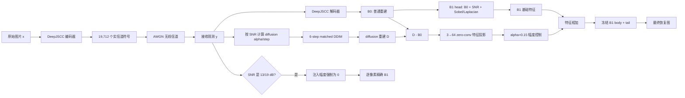

# 最近进度、指标对比与技术数据流程（2026-07-20）

> 后续更新：S25 已用 oracle 证明 S23 feature direction 的逐图 amplitude headroom 只有 `+0.001365 dB`，该 controller 路线关闭；S26 随后把冻结 S19 fusion 限定在 1/4/7 dB，并在 13/19 dB 结构性回退 B1，在另一 population 上相对 B1 得到 `+0.093267 dB/-0.007661 LPIPS`，9/9 检查通过。当前最好方法已更新为 S26。详见 `reports/s19_exact_fallback_replication_stage_result_2026-07-20.md`。

## 0. 给非专业读者的一分钟结论

这个项目解决的是：一张图片经过有噪声的无线信道以后，怎样既恢复得清楚，又不让生成模型“自作主张”改掉图片内容。

当前系统有两个接收端助手：

- **B1** 像一个保守的修图师，主要根据收到的图和边缘结构去除信道噪声，优点是忠实、稳定；
- **matched diffusion** 像一个见过很多自然图片的画师，能补出更自然的细节，但有猜错内容的风险。

最新 S23 不是让画师替代修图师，而是让画师只提供很小的特征建议。低 SNR 时使用这条建议，高 SNR 时完全关闭，因此能逐像素精确回到 B1。

在新的 256 张图片×5 个 SNR 独立测试上，当前融合相对 B1：

- PSNR `+0.000568 dB`；
- MS-SSIM `+0.0000224`；
- LPIPS `-0.001731`；
- 三项质量指标的 source-image cluster 95% CI 都不跨 0；
- 三分类器多数票语义失败从 `744` 降到 `740`，发生 `3` 个新错、`7` 个修复，但该语义失败率差值的 CI 仍跨 0。

所以现在可以证明“B1 和 diffusion 能安全地非零合并”，但还不能说方法很强：PSNR 实际增益只有约万分之五点七 dB。当前是机制闭环，不是 SOTA。

## 1. 最近研究进度

### S17：让信道噪声和 diffusion step 对上

无线信道输出经过功率归一化以后，可解释成 diffusion forward process 的一个带噪中间状态；当前 SNR 决定它对应多大的 `alpha`。接收端从这个状态开始做 6-step deterministic DDIM，而不是从纯随机噪声重新生成。

通俗地说：不是让画师面对一张白纸猜图片，而是把真实收到的带噪草稿交给画师，并告诉他“这张草稿现在大概脏到什么程度”。

### S18：低 SNR 用 diffusion，高 SNR 原样返回

冻结策略为：1/4/7 dB 使用 matched diffusion，13/19 dB 精确返回普通 JSCC 的 B0。相对 B0，PSNR `+0.18972 dB`、LPIPS `-0.03628`，10/10 预注册检查通过；但 B1 仍比这条 diffusion 路线高 `+0.83062 dB` PSNR，所以不能直接丢掉 B1。

### S19：证明 diffusion 真的有额外信息

S19 使用两个同为 `450,115` 参数的网络：control 只看两份 B0，fusion 看 B0 和 diffusion；训练数据、初始化、batch、crop 和参数量完全一致。

fusion 相对 control：

- PSNR `+0.05843 dB`，95% CI `[+0.05203,+0.06437]`；
- MS-SSIM `+0.001371`，CI `[+0.001211,+0.001532]`；
- LPIPS `-0.001487`，CI `[-0.002155,-0.000803]`。

这证明 improvement 不是“多加了一个 CNN”带来的；diffusion 分支确实包含 B0-only 网络没有的信息。

S19 相对 B1 的 PSNR 为 `+0.10173 dB`，是目前质量增益最大的融合版本。但它在 13/19 dB 相对 matched control 出现负迁移，高 SNR LPIPS 也会退化，不能保证精确回到 B1。

### S20：真正运行 SGD-JSCC 做外部对照

在独立 Imagenette、三 channel seeds、相同噪声重放的有利“免费完美文本”论文上界协议下：

- SGD 相对普通 B0：PSNR `+0.63461 dB`、LPIPS `-0.18332`，说明它明显强于普通 JSCC；
- SGD 相对 B1：PSNR `-0.38422 dB`，但 MS-SSIM `+0.006276`、LPIPS `-0.08730`；
- SGD 相对 B1 有 `11 new / 21 repair`，failure-rate CI 跨 0；
- SGD 图像+边缘已经使用 `19,712 real symbols`，四条 caption 最少还要 `2,144 real symbols`，严格统一码率下会超预算 `10.88%`；
- 实测约 `2064.7 ms/图`，B1 为 `2.642 ms/图`，约慢 `781×`。

因此 SGD 是很强的感知上界，但不能得出“全程替换 B1”的结论。

### S21：输出层合并失败

已经系统排除了三种看似自然但不稳定的做法：

- learned gate 会塌到 0；
- fixed-gate residual 会达到 envelope 上限并使 PSNR 崩溃；
- 120 个 B1/diffusion 像素凸融合中，只有全零 B1 同时满足冻结的 PSNR/LPIPS 条件。

### S22--S23：转向 B1 特征空间，找到非零安全点

S22 冻结 B1，仅新增 `Conv3x3(3→64)`，把 `D-B0` 注入 B1 head feature。新增可训练参数只有 `1,728`。完整幅度会明显改善 LPIPS，却让 PSNR 下降约 `0.018--0.020 dB`。

S23 在结果产生前冻结全局 shrink 网格，选出 `alpha=0.15`。这说明 S22 的 feature direction 不是错的，只是完整幅度过冲。随后独立 holdout 和 bootstrap 5/5 通过。

## 2. 当前 S23 同一测试集上的完整指标

测试集为全新 COCO train2017 来源的 256 张图片，每张在 1/4/7/13/19 dB 下评估，共 1,280 行。表中 PSNR/MS-SSIM 越高越好，LPIPS/失败率越低越好。

| 方法 | PSNR ↑ | MS-SSIM ↑ | LPIPS ↓ | 三分类器多数票失败 | AlexNet clean-confident 失败 |
|---|---:|---:|---:|---:|---:|
| B0：普通 JSCC | 26.46104 | 0.919915 | 0.300710 | 959/1280 = 74.92% | 525/860 = 61.05% |
| matched diffusion 单支路 | 26.67858 | 0.932561 | 0.261052 | 886/1280 = 69.22% | 482/860 = 56.05% |
| B1 保真锚点 | 27.56772 | 0.943591 | 0.183951 | 744/1280 = 58.13% | 352/860 = 40.93% |
| **S23 当前融合** | **27.56829** | **0.943613** | **0.182220** | **740/1280 = 57.81%** | **351/860 = 40.81%** |

这里的语义指标是冻结 ImageNet 分类器相对原图预测的一致性诊断，不是 COCO 人工类别真值；因此可用于固定方法间比较，但不能写成真实语义准确率。

可视化：[同一 holdout 质量图](../outputs/analysis/ANALYSIS-S24-RECENT-PROGRESS-SUMMARY-001/s23_same_holdout_quality_readable.png)、[辅助语义失败图](../outputs/analysis/ANALYSIS-S24-RECENT-PROGRESS-SUMMARY-001/s23_semantic_failure_readable.png)。

## 3. 当前融合相对各基线的配对结果

| 对比 | ΔPSNR 及 95% CI | ΔMS-SSIM 及 95% CI | ΔLPIPS 及 95% CI | 多数票语义事件 |
|---|---:|---:|---:|---:|
| S23 − B1 | `+0.000567` `[+0.000376,+0.000762]` | `+0.0000224` `[+0.0000116,+0.0000338]` | `-0.001731` `[-0.001844,-0.001619]` | `3 new / 7 repair`；failure CI 跨 0 |
| S23 − matched diffusion | `+0.88971` `[+0.84945,+0.93040]` | `+0.011054` `[+0.010450,+0.011659]` | `-0.07885` `[-0.08344,-0.07421]` | `78 new / 224 repair`；净修复显著 |
| S23 − B0 | `+1.10737` `[+1.05204,+1.16345]` | `+0.023698` `[+0.022063,+0.025375]` | `-0.11850` `[-0.12430,-0.11275]` | `56 new / 275 repair`；净修复显著 |

S23 相对 B0 的大部分收益来自 B1；S23 新增 diffusion feature 对 B1 的额外 PSNR 很小，但 LPIPS 改善更明显。

分 SNR 的 S23−B1：

| SNR | ΔPSNR | ΔLPIPS | 解释 |
|---:|---:|---:|---|
| 1 dB | +0.000701 | -0.003789 | 信道最差，感知增益最大 |
| 4 dB | +0.001158 | -0.003000 | PSNR 增益最大 |
| 7 dB | +0.000979 | -0.001864 | 仍为非零安全注入 |
| 13 dB | 0 | 0 | 结构性关闭，精确 B1 |
| 19 dB | 0 | 0 | 结构性关闭，精确 B1 |

可视化：[分 SNR 增益图](../outputs/analysis/ANALYSIS-S24-RECENT-PROGRESS-SUMMARY-001/s23_per_snr_deltas_readable.png)。

## 4. 和其他方案怎样公平比较

### 4.1 可以直接排的

同一行图片、同一 SNR、同一 channel realization 下的 B0、diffusion、B1、control、fusion 可以直接比较。S19 和 S23 各自内部的表属于这一类。

### 4.2 只能比较相对差值的

S19、S23 和 S20 使用不同 frozen population。跨 population 时只能比较“相对自己的 anchor 改善了多少”和协议性质，不能把绝对 PSNR 直接排成排行榜。

| 方案 | 主要优点 | 已确认问题 | 当前判断 |
|---|---|---|---|
| 普通 DeepJSCC/B0 | 快、简单、严格码率 | 低 SNR 质量和语义一致性差 | 必要底线 baseline |
| matched diffusion 单支路 | 相比 B0 感知质量明显好；信道噪声与 diffusion step 有自然对应 | 保真度明显低于 B1，存在猜错内容风险 | 有价值的辅助先验，不适合单独取代 B1 |
| B1 | PSNR、LPIPS、语义诊断都很强；约 2.5 ms/图的接收端后处理 | 不使用生成先验的额外信息 | 当前主锚点 |
| S19 joint fusion | 相对 B1 `+0.1017 dB/-0.00640 LPIPS`，目前幅度最强 | 高 SNR 负迁移，不能 exact fallback | 当前质量上限候选 |
| **S23 当前融合** | exact-B1 fallback；三项质量 CI 通过；只训练 1,728 参数 | 额外 PSNR 仅 `+0.00057 dB`；语义改善不显著 | 当前最干净的安全机制闭环 |
| SGD-JSCC paper upper | 感知指标很强，文本+结构约束自然 | 相对 B1 PSNR 更低；文本未计统一码率；约 781× 慢 | 强外部感知上界，不能直接宣布公平胜负 |
| SING / DiT-JSCC 等 | 文献上更强的生成式/后验恢复设计 | 当前没有在本项目 common contract 下精确复现 | 暂时只能定性定位，不能填数字 |

严格回答“现在最好的是谁”：

- 看**绝对质量增益幅度**，S19 fusion 仍是本项目最强融合版本；
- 看**结构安全与实验干净程度**，S23 是当前最好的版本，因为高 SNR 和 control 能精确回到 B1；
- 看**感知生成上界**，SGD-JSCC 很强，但协议、码率和计算量还不公平；
- 当前还不存在一个同时拥有 S19 增益幅度和 S23 安全边界的最终方法。

## 5. 各指标到底是什么意思

- **PSNR**：逐像素是否接近原图。越高越忠实，但不完全等于“人眼更喜欢”。
- **MS-SSIM**：多尺度结构是否相似，例如轮廓、区域和纹理布局。越高越好。
- **LPIPS**：深度特征空间中的感知距离。越低通常越像人眼认为的原图。
- **Semantic failure**：冻结分类器对恢复图和原图给出的类别是否一致。越低越好。
- **New error**：B1 原来语义判断正确，融合以后变错；这是项目最在意的 semantic drift。
- **Repair**：B1 原来错，融合以后变对。
- **95% CI**：把“图片”作为抽样单位反复重采样，检查平均增益是否可能只是测试图片碰巧造成。区间跨 0 就不能声称差异显著。
- **Real symbols / complex channel uses**：真正占用无线信道的预算。本项目为 `19,712 real = 9,856 complex uses`，S19/S23 不增加 side-information symbols。
- **参数量**：B1 为 `448,387`；S23 只新增 `1,728`，总计 `450,115`。
- **接收端延迟**：在 RTX 4090 D、batch 16、已缓存 B0 和 diffusion 的 microbenchmark 中，B1 为 `2.491 ms/图`，S23 fusion 为 `2.602 ms/图`，新增约 `0.110 ms/图`、`4.43%`。这不包含 DeepJSCC 和低 SNR 6-step diffusion，所以不是系统端到端延迟。

本轮没有计算 FID：256 张 holdout 对分布指标偏小，而且没有为本轮冻结 FID 统计协议。为了避免为了“指标多”而给出不可靠数字，当前保留 PSNR、MS-SSIM、LPIPS、语义事件、置信区间、码率、参数和延迟八类证据。

## 6. 当前技术的数据流程

### 6.1 一张图怎样走完整个系统

关键点：diffusion 和 B1 都来自**同一个接收观测**，没有额外发送文本、边缘图或第二张图片，所以无线码率仍是 19,712 real symbols。

### 6.2 为什么要用 `D-B0`，而不是直接把 D 接在 B1 后面

`D-B0` 表示“生成先验相对普通接收图到底建议改什么”。zero-conv 再把 RGB 修改建议翻译成 B1 能理解的 64 通道 feature。这样 B1 仍是主干，diffusion 只是辅助信息。

如果投影权重为 0、`D=B0`，或者高 SNR envelope 为 0，整个系统都会退化为原 B1。这是数学结构保证，不依赖网络自己学会回退。

### 6.3 数据怎样分，避免考试题泄漏

- train：5,000 张，用于学习 projection direction；
- selection：256 张，用于选择 checkpoint 和 `alpha=0.15`；
- holdout：另外 256 张，policy 和 checkpoint SHA 冻结后只访问一次；
- 每张图评估 5 个 SNR；统计 bootstrap 时把一张图的 5 行绑成一个 cluster，不能把它们误当成 5 张独立图片。

这相当于：训练集是练习题，selection 是模拟考试，holdout 才是正式考试。

### 6.4 语义分类器在系统里做什么

当前 S23 推理时**不读取分类器结果**。AlexNet、ResNet18 和 MobileNetV3-Small 只在实验结束后充当检查员，判断恢复图是否改变了原图的预测语义。

因此当前系统还不是完整的 sample-adaptive semantic controller。下一步要做的是让 receiver-visible risk/amplitude controller 在每张图上决定注入多少，同时不能把测试分类器或原图标签偷偷喂给系统。

## 7. 当前研究水平与下一步

现在最扎实的贡献不是一个夸张的最高 PSNR，而是三条证据链：

1. 信道噪声与 diffusion state 有明确数学对应，不是生硬地把 diffusion 接到 JSCC 后面；
2. S19 等容量因果消融证明 diffusion 确有 B0/B1 之外的信息；
3. S23 在严格同码率、exact fallback 和独立 holdout 下证明非零安全注入可行。

不足也很清楚：S23 增益太小、语义 improvement CI 跨 0、6-step diffusion 端到端延迟尚未在当前 common contract 下单独冻结统计、S23 尚未在与 SGD 相同的 Imagenette population 上直接运行。

下一阶段的主任务应是：学习或解析 **SNR/sample-adaptive amplitude**，争取保留 S19 的增益量级和 S23 的 exact fallback；然后在同一 common population 上直接比较 B1、S19、S23、SGD，并补端到端延迟和独立监督语义审计。不要继续细扫全局 alpha，也不要只增加一个没有因果消融的小模块。

## 8. 本轮派生指标产物

- 聚合配置：`configs/s24_recent_progress_metrics.yaml`
- 可复现脚本：`scripts/s24_recent_progress_metrics.py`
- 输出目录：`outputs/analysis/ANALYSIS-S24-RECENT-PROGRESS-SUMMARY-001/`
- summary SHA256：`72b607fa9b405fddad9b95341850993ec0a8bb66f0238bfdcf96f680d5c4f327`
- 同 population 指标 CSV SHA256：`75c14d370fe926648f776601e3718c05b617918c1171bf2d51a97a1191a0d4b2`

本轮只读取既有 frozen outputs，未重新选模型、未修改 holdout policy、未访问 official Imagenette validation、未联网或下载。
